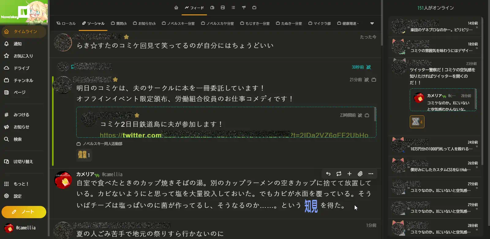

# Tanukey カスタム
## アイテム
### custom-css-camellia-taste.css
- ノートの文字を大きく（ 22px ）
- ノートの文字をより多く表示するよう調整
- 既読の RN を非表示

#### スクリーンショット

### theme-camellia-taste.txt
- カメリア🐢的な Monokai 観によるテーマ
- 野良テーマ（＝非公式）

### custom-css-reaction-image-expansion.css
- ノートに付いたリアクションの絵文字を大きく表示する
- 数値の編集によってサイズを調整できる（小数可）
## ライセンス
ライセンスは [CC0](https://creativecommons.jp/sciencecommons/aboutcc0/) です。
> CC0 とは、科学者や教育関係者、アーティスト、その他の著作権保護コンテンツの作者・所有者が、著作権による利益を放棄し、作品を完全にパブリック・ドメインに置くことを可能にするものです。CC0によって、他の人たちは、著作権による制限を受けないで、自由に、作品に機能を追加し、拡張し、再利用することができるようになります。
> 
> CC ライセンスが、権利所有者に著作権を残しながら、再利用の許可を選択できるものであったのに対して、CC0は別の新たな選択肢を提供します。作品の作者に自動的に付与されてきた著作権やその他の占有権を放棄するという選択肢です。他のCCライセンスと異なり、「いかなる権利も保有しない」という選択肢を与えるものです。
